# 도메인 레이어 아키텍처 문서
## 농사 시스템 & Helper 시스템

> 작성일: 2026-04-01  
> 분석 범위: UI → Domain → Repository → Data 레이어 구조

---

## 목차

1. [전체 아키텍처 개요](#1-전체-아키텍처-개요)
2. [레이어 정의 및 책임](#2-레이어-정의-및-책임)
3. [Helper 시스템 레이어 구조](#3-helper-시스템-레이어-구조)
4. [농사 시스템 레이어 구조](#4-농사-시스템-레이어-구조)
5. [레이어 간 통신 방식](#5-레이어-간-통신-방식)
6. [Repository 패턴 구현](#6-repository-패턴-구현)
7. [도메인 규칙 캡슐화 위치](#7-도메인-규칙-캡슐화-위치)
8. [저장/로드 전체 흐름](#8-저장로드-전체-흐름)
9. [이벤트 채널 시스템](#9-이벤트-채널-시스템)
10. [두 시스템 비교](#10-두-시스템-비교)
11. [구조적 강점 및 개선 가능 영역](#11-구조적-강점-및-개선-가능-영역)

---

## 1. 전체 아키텍처 개요

이 프로젝트는 명시적인 4-레이어 구조를 채택하고 있으며, 레이어 간 통신은 **이벤트**, **ScriptableObject 채널**, **인터페이스**를 혼합하여 느슨한 결합(Loose Coupling)을 유지합니다.

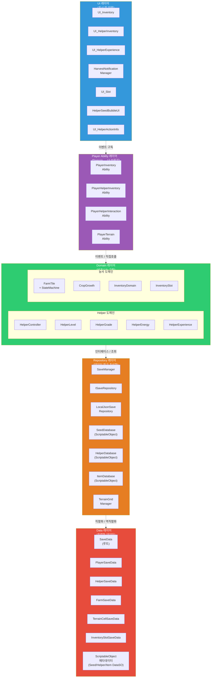

---

## 2. 레이어 정의 및 책임

| 레이어 | 위치 | 책임 | 의존 방향 |
|--------|------|------|----------|
| **UI** | `InGame/*/UI/`, `OutGame/UI/` | 화면 표시, 사용자 입력 수신 | Ability 이벤트 구독 |
| **Player Ability** | `InGame/Player/Abilities/` | UI ↔ Domain 중개, ISaveableAbility 구현 | Domain 호출, UI에 이벤트 발행 |
| **Domain** | `InGame/Helper/Core/`, `InGame/Farming/Tile|Crop/` | 비즈니스 규칙, 상태 관리 | Repository 인터페이스 사용 |
| **Repository** | `OutGame/Save/`, `InGame/*/Data/Database` | 데이터 영속성, 조회 | Data 클래스 직렬화 |
| **Data** | `OutGame/Save/Data/`, `ScriptableObjects/` | 순수 데이터 구조 (직렬화 가능) | 없음 (최하단) |

### 의존성 방향 원칙

```
UI → Ability → Domain → Repository → Data
(상위 레이어는 하위 레이어를 알고, 하위 레이어는 상위 레이어를 모름)
```

---

## 3. Helper 시스템 레이어 구조

### 3.1 전체 레이어 맵

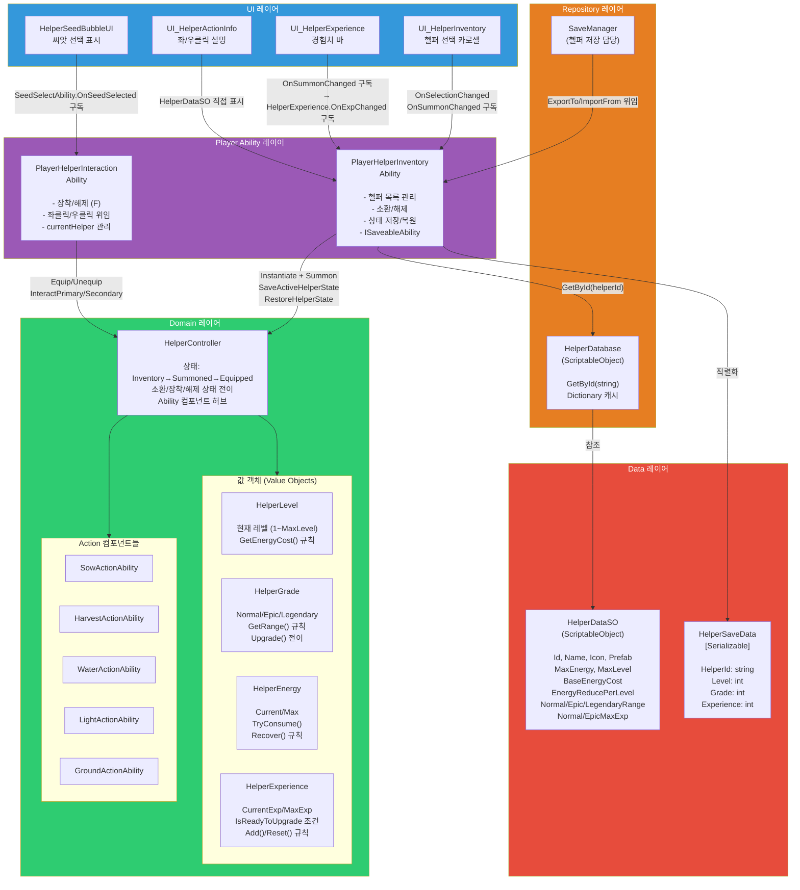

### 3.2 Helper 도메인 규칙 상세

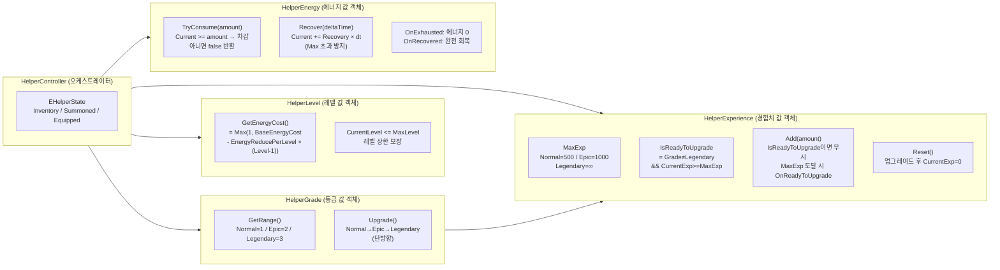

### 3.3 Helper UI → Domain 이벤트 흐름

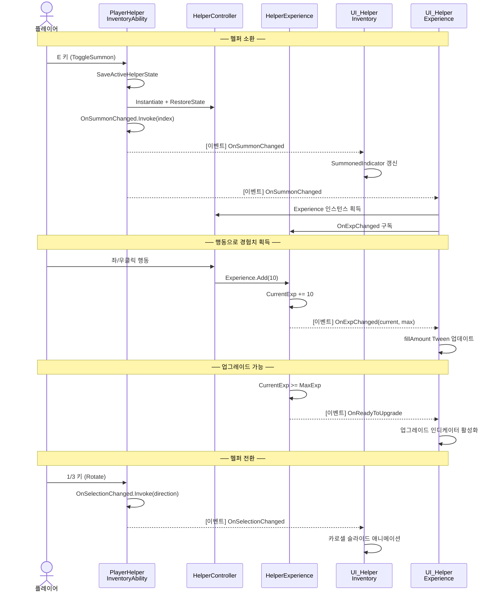

---

## 4. 농사 시스템 레이어 구조

### 4.1 전체 레이어 맵

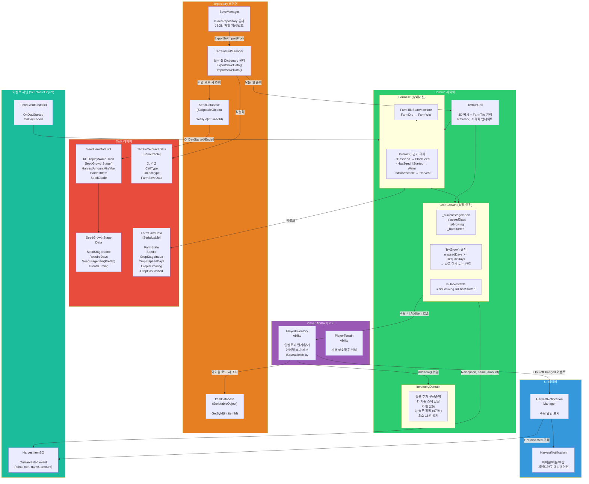

### 4.2 FarmTile 도메인 규칙 상세

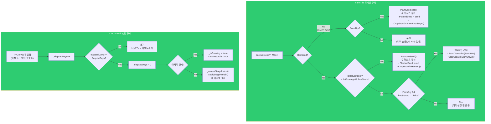

### 4.3 농사 UI → Domain 이벤트 흐름

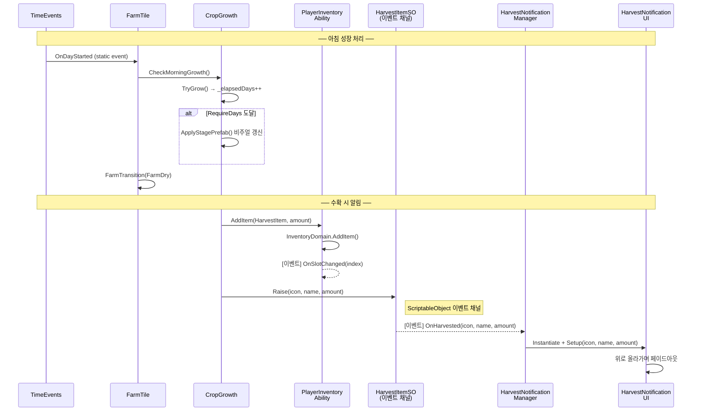

---

## 5. 레이어 간 통신 방식

이 프로젝트는 3가지 통신 방식을 레이어별로 다르게 사용합니다.

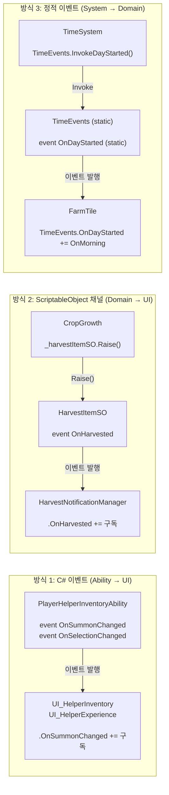

### 통신 방식 비교표

| 방식 | 사용 위치 | 결합도 | 장점 | 단점 |
|------|----------|--------|------|------|
| **C# 이벤트** | Ability → UI | 약함 | 타입 안전, 컴파일 타임 검증 | 구독 해제 주의 필요 |
| **ScriptableObject 채널** | Domain → UI | 보통 | 에디터에서 연결 확인 가능 | ScriptableObject 의존 |
| **정적 이벤트** | TimeSystem → 모든 FarmTile | 매우 약함 | 전역 접근, 구조 단순 | 구독 해제 필수, 테스트 어려움 |
| **직접 참조** | Domain 내부 | 강함 | 명확한 의존성 | 교체 어려움 |

---

## 6. Repository 패턴 구현

### 6.1 명시적 Repository (저장/로드)

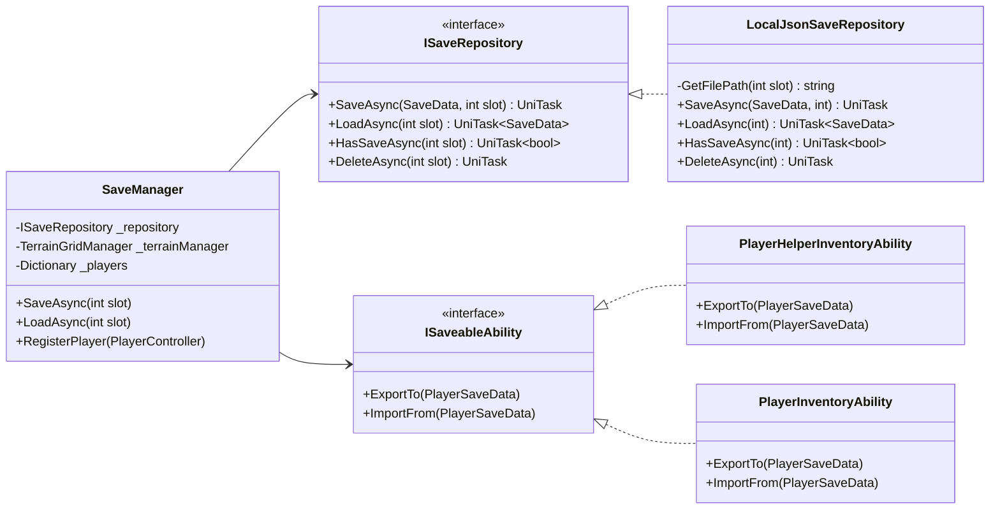

**LocalJsonSaveRepository 동작**:
```
SaveAsync(data, slot):
  path = Application.persistentDataPath/save_{slot}.json
  json = JsonUtility.ToJson(data)
  await File.WriteAllTextAsync(path, json)

LoadAsync(slot):
  path = Application.persistentDataPath/save_{slot}.json
  json = await File.ReadAllTextAsync(path)
  return JsonUtility.FromJson<SaveData>(json)
```

### 6.2 암묵적 Repository (Database - 조회 전용)

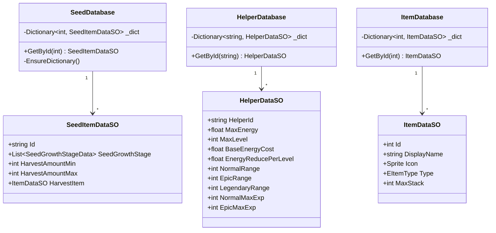

---

## 7. 도메인 규칙 캡슐화 위치

### 7.1 Helper 시스템 도메인 규칙

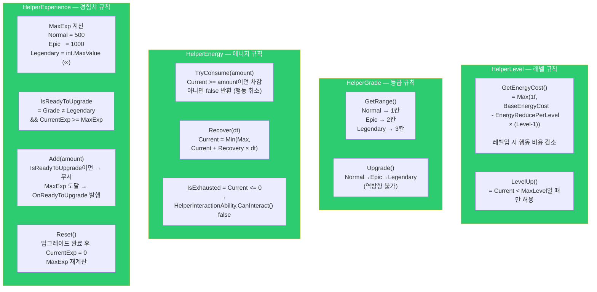

### 7.2 농사 시스템 도메인 규칙

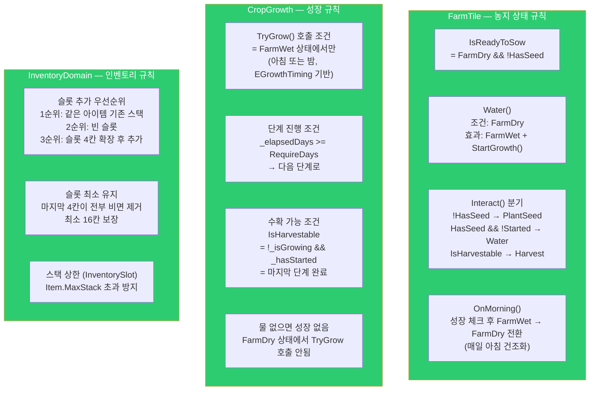

### 도메인 규칙 위치 요약표

| 규칙 | 클래스 | 레이어 |
|------|--------|--------|
| 에너지 비용 = f(레벨) | `HelperLevel.GetEnergyCost()` | Domain |
| 행동 범위 = f(등급) | `HelperGrade.GetRange()` | Domain |
| 업그레이드 가능 여부 | `HelperExperience.IsReadyToUpgrade` | Domain |
| 최대 경험치 = f(등급) | `HelperExperience.MaxExp` | Domain |
| 에너지 소비/회복 | `HelperEnergy.TryConsume(), Recover()` | Domain |
| 행동 가능 여부 | `HelperInteractionAbility.CanInteract()` | Domain |
| 농지 전환 조건 | `TerrainCell.TryConvertToFarm()` | Domain |
| 씨앗 심기 조건 | `FarmTile.IsReadyToSow` | Domain |
| 성장 진행 조건 | `CropGrowth.TryGrow()` | Domain |
| 수확 가능 여부 | `CropGrowth.IsHarvestable` | Domain |
| 슬롯 확장/축소 규칙 | `InventoryDomain` | Domain |
| 스택 상한 | `InventorySlot.TryAdd()` | Domain |

---

## 8. 저장/로드 전체 흐름

### 8.1 저장 흐름 (Save)

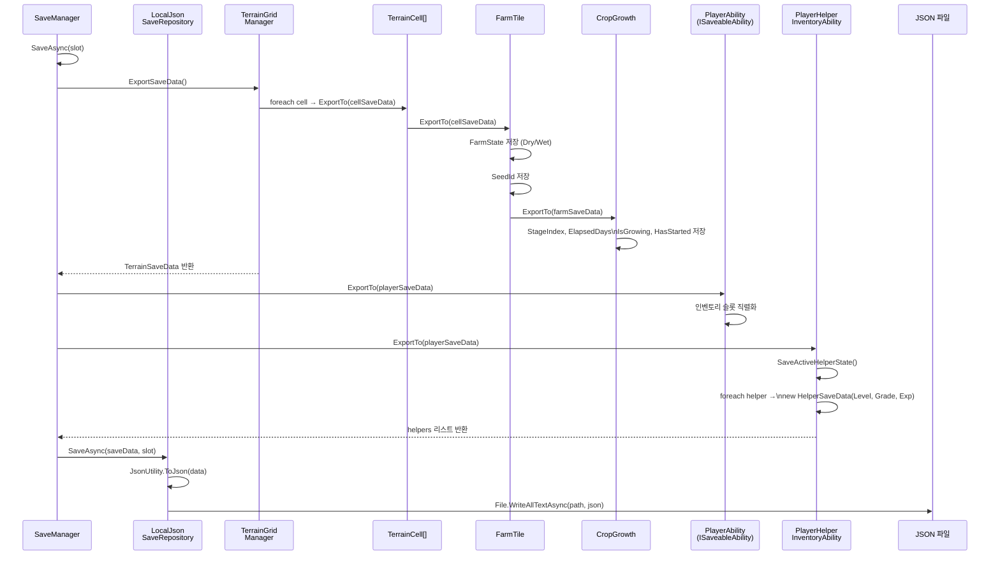

### 8.2 로드 흐름 (Load)

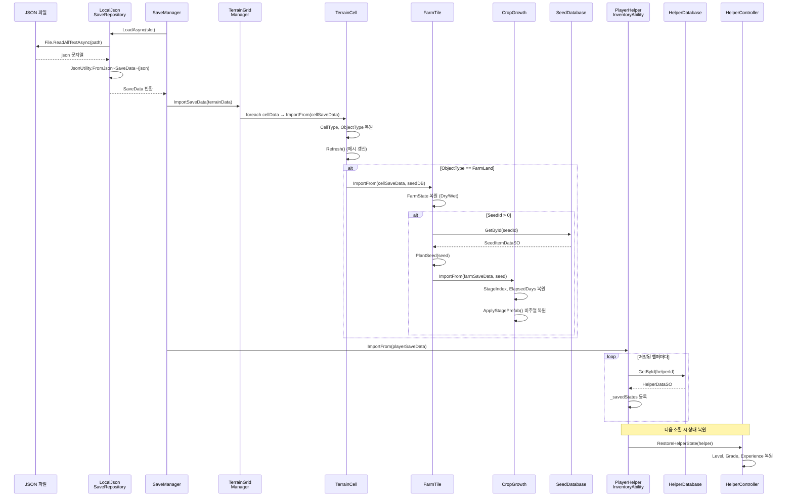

### 8.3 SaveData 계층 구조

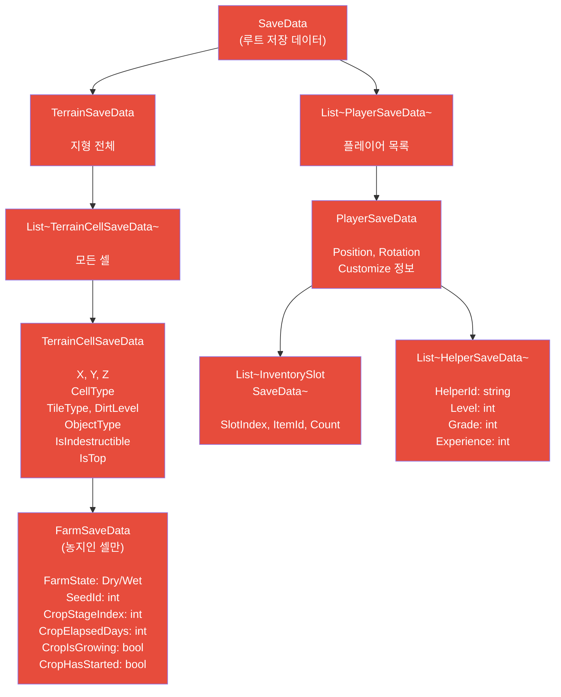

---

## 9. 이벤트 채널 시스템

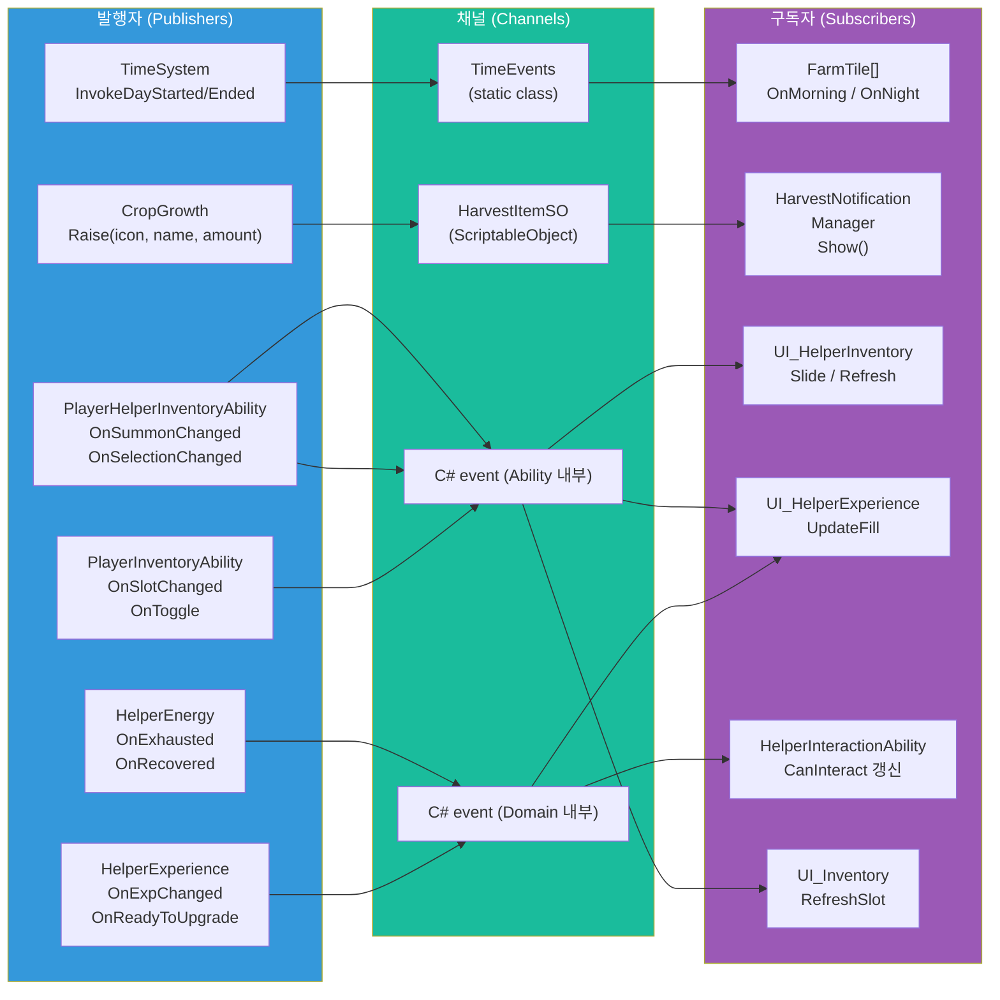

---

## 10. 두 시스템 비교

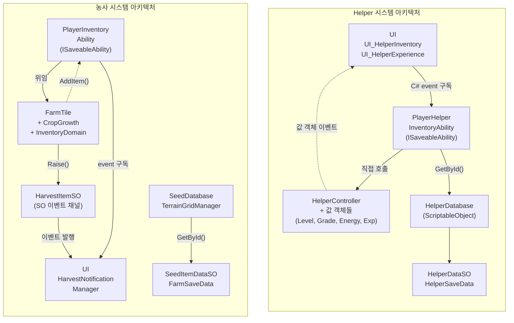

### 핵심 차이점

| 항목 | Helper 시스템 | 농사 시스템 |
|------|--------------|------------|
| **도메인 구조** | 값 객체 패턴 (Level, Grade, Energy, Exp) | 상태 머신 패턴 (FarmDry ↔ FarmWet) |
| **UI 통신** | C# 이벤트 (Ability 레이어 경유) | ScriptableObject 채널 (도메인 직접 발행) |
| **상태 저장** | Dictionary 캐시 + ISaveableAbility | TerrainGridManager 순회 + ExportTo 패턴 |
| **성장 트리거** | 플레이어 입력 기반 | 시간 이벤트 기반 (TimeEvents.OnDayStarted) |
| **데이터 조회** | HelperDatabase (string ID) | SeedDatabase (int ID) |
| **네트워크 동기화** | Photon RPC (모든 행동) | RPC (땅 파기/채우기만) |

---

## 11. 구조적 강점 및 개선 가능 영역

### 강점 (잘 설계된 부분)

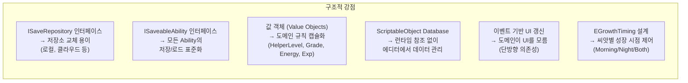

### 개선 가능 영역

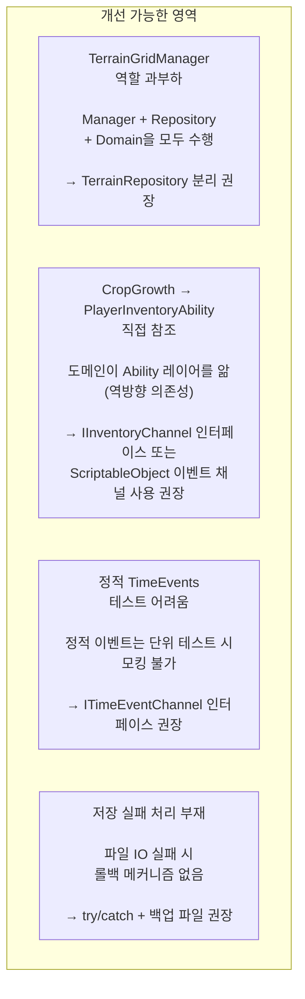

#### 개선 예시: CropGrowth의 역방향 의존성 해결

```
현재 구조:
  CropGrowth (Domain) → PlayerInventoryAbility (Ability)  ← 역방향 의존

개선 구조:
  CropGrowth (Domain) → IHarvestReceiver (인터페이스)
                              ↑ 구현
                        PlayerInventoryAbility (Ability)

또는:
  CropGrowth (Domain) → HarvestItemSO (이벤트 채널)
                              ↓ 구독
                        PlayerInventoryAbility (Ability)
```

---

## 레이어별 파일 위치 최종 정리

### Helper 시스템

| 레이어 | 파일 경로 | 역할 |
|--------|----------|------|
| **UI** | `Helper/UI/UI_HelperInventory.cs` | 헬퍼 카로셀 UI |
| **UI** | `Helper/UI/UI_HelperExperience.cs` | 경험치 바 |
| **UI** | `Helper/UI/UI_HelperActionInfo.cs` | 행동 설명 |
| **UI** | `Helper/UI/HelperSeedBubbleUI.cs` | 씨앗 선택 표시 |
| **Ability** | `Player/Abilities/PlayerHelperInventoryAbility.cs` | 헬퍼 인벤토리 + ISaveableAbility |
| **Ability** | `Player/Abilities/PlayerHelperInteractionAbility.cs` | 상호작용 중개 |
| **Domain** | `Helper/Core/HelperController.cs` | 헬퍼 상태 머신 |
| **Domain** | `Helper/Core/HelperLevel.cs` | 레벨 값 객체 |
| **Domain** | `Helper/Core/HelperGrade.cs` | 등급 값 객체 |
| **Domain** | `Helper/Core/HelperEnergy.cs` | 에너지 값 객체 |
| **Domain** | `Helper/Upgrade/HelperExperience.cs` | 경험치 값 객체 |
| **Repository** | `Helper/Data/HelperDatabase.cs` | 헬퍼 ID 조회 |
| **Data** | `Helper/Data/HelperDataSO.cs` | 헬퍼 메타데이터 (SO) |
| **Data** | `OutGame/Save/Data/HelperSaveData.cs` | 헬퍼 저장 데이터 |

### 농사 시스템

| 레이어 | 파일 경로 | 역할 |
|--------|----------|------|
| **UI** | `Farming/Crop/HarvestNotificationManager.cs` | 수확 알림 관리 |
| **UI** | `Farming/Crop/HarvestNotification.cs` | 알림 단위 UI |
| **Ability** | `Player/Abilities/PlayerInventoryAbility.cs` | 인벤토리 + ISaveableAbility |
| **Domain** | `Farming/Tile/FarmTile.cs` | 농지 상태 머신 |
| **Domain** | `Farming/Tile/FarmTileStateMachine.cs` | Dry/Wet 전이 |
| **Domain** | `Farming/Crop/CropGrowth.cs` | 작물 성장 엔진 |
| **Domain** | `Inventory/Core/InventoryDomain.cs` | 인벤토리 규칙 |
| **Domain** | `Inventory/Core/InventorySlot.cs` | 슬롯 값 객체 |
| **Repository** | `Farming/Grid/TerrainGridManager.cs` | 격자 관리 + 저장 포맷 변환 |
| **Repository** | `Farming/Data/SeedDatabase.cs` | 씨앗 ID 조회 |
| **Repository** | `OutGame/Save/LocalJsonSaveRepository.cs` | JSON 파일 저장소 |
| **Data** | `Farming/Data/SeedItemDataSO.cs` | 씨앗 메타데이터 (SO) |
| **Data** | `OutGame/Save/Data/FarmSaveData.cs` | 농지 저장 데이터 |
| **Data** | `OutGame/Save/Data/TerrainCellSaveData.cs` | 셀 저장 데이터 |
| **이벤트 채널** | `Farming/Data/HarvestItemSO.cs` | 수확 이벤트 채널 (SO) |
| **이벤트 채널** | `TimeSystem/TimeEvents.cs` | 시간 이벤트 채널 (static) |

---

*이 문서는 Helper 및 농사 시스템의 도메인 레이어 아키텍처를 분석하여 작성되었습니다.*
