# 농사/작물 성장(CropGrowth) 시스템 문서

> 작성일: 2026-04-01  
> 브랜치: feat/sj/helper-upgrade-system

---

## 목차

1. [시스템 개요](#1-시스템-개요)
2. [디렉토리 구조](#2-디렉토리-구조)
3. [클래스 계층 다이어그램](#3-클래스-계층-다이어그램)
4. [FarmTile 상태 머신](#4-farmtile-상태-머신)
5. [작물 성장 시스템 (CropGrowth)](#5-작물-성장-시스템-cropgrowth)
6. [씨앗 심기 → 수확 전체 흐름](#6-씨앗-심기--수확-전체-흐름)
7. [농지 변환 로직](#7-농지-변환-로직)
8. [시간 시스템과 성장 트리거](#8-시간-시스템과-성장-트리거)
9. [씨앗 선택 시스템](#9-씨앗-선택-시스템)
10. [수확 알림 시스템](#10-수확-알림-시스템)
11. [지형/격자 시스템](#11-지형격자-시스템)
12. [저장/로드 시스템](#12-저장로드-시스템)
13. [데이터 구조](#13-데이터-구조)

---

## 1. 시스템 개요

농사 시스템은 다음 5개 서브시스템으로 구성됩니다:

| 서브시스템 | 역할 |
|-----------|------|
| **FarmTile** | 농지 한 칸의 상태(건조/습윤) 및 씨앗 심기/수확 관리 |
| **CropGrowth** | 작물의 성장 단계 진행 및 수확 가능 여부 판정 |
| **TerrainGrid** | 격자 기반 지형 관리, 농지 변환, 파기/채우기 |
| **TimeSystem** | 하루 주기(아침/밤) 이벤트로 성장 트리거 |
| **Helper Actions** | 파종(Sow), 관수(Water), 수확(Harvest) 실제 행동 수행 |

**핵심 플로우**

```
일반 땅(Dirt) → [경작] → FarmLand(FarmTile 활성화)
                              ↓ 씨앗 심기(Sow)
                         FarmDry + 작물(1단계)
                              ↓ 물주기(Water)
                         FarmWet → 성장 시작
                              ↓ 아침/밤 경과
                         단계 1 → 단계 2 → ... → 수확 가능
                              ↓ 수확(Harvest)
                         아이템 획득 + FarmTile 초기화
```

---

## 2. 디렉토리 구조

```
Assets/02.Scripts/InGame/Farming/
├── Tile/                          # 농지 상태 관리
│   ├── FarmTile.cs                # 농지 메인 클래스
│   ├── FarmTileStateMachine.cs    # 건조/습윤 상태 머신
│   ├── EFarmTileStateType.cs      # 상태 열거형
│   ├── IFarmTileState.cs          # 상태 인터페이스
│   ├── FarmDryState.cs            # 건조 상태
│   └── FarmWetState.cs            # 습윤 상태
│
├── Crop/                          # 작물 성장 시스템
│   ├── CropGrowth.cs              # 성장 단계 관리
│   ├── SeedGrowthStageData.cs     # 단계별 설정 데이터
│   ├── EGrowthTiming.cs           # 성장 타이밍 열거형
│   ├── ESeedGrade.cs              # 씨앗 등급 열거형
│   ├── HarvestNotification.cs     # 수확 알림 UI
│   └── HarvestNotificationManager.cs
│
├── Data/                          # 데이터 정의
│   ├── SeedItemDataSO.cs          # 씨앗 ScriptableObject
│   ├── SeedDatabase.cs            # 씨앗 ID 기반 조회
│   └── HarvestItemSO.cs           # 수확 알림 이벤트 채널
│
└── Grid/                          # 지형/격자 시스템
    ├── TerrainCell.cs             # 격자 한 칸
    ├── TerrainCellData.cs         # 셀 데이터
    ├── TerrainGridData.cs         # 격자 전체 데이터
    ├── TerrainGridManager.cs      # 격자 관리자
    ├── ECellType.cs               # 셀 타입 열거형
    └── EGridObjectType.cs         # 격자 오브젝트 타입 열거형

Assets/02.Scripts/InGame/Helper/Actions/
├── SowActionAbility.cs            # 파종 액션
├── HarvestActionAbility.cs        # 수확 액션
├── WaterActionAbility.cs          # 관수 액션
├── CultivateAbility.cs            # 경작 Jump & Cultivate
├── TillActionAbility.cs           # 개간 액션
├── SeedSelectAbility.cs           # 씨앗 선택기
└── GroundActionAbility.cs         # 땅 파기/채우기

Assets/02.Scripts/InGame/TimeSystem/
└── TimeEvents.cs                  # 아침/밤 이벤트 채널

Assets/02.Scripts/OutGame/Save/Data/
├── FarmSaveData.cs                # 농지 저장 데이터
├── TerrainCellSaveData.cs         # 셀 저장 데이터
└── TerrainSaveData.cs             # 지형 전체 저장 데이터
```

---

## 3. 클래스 계층 다이어그램

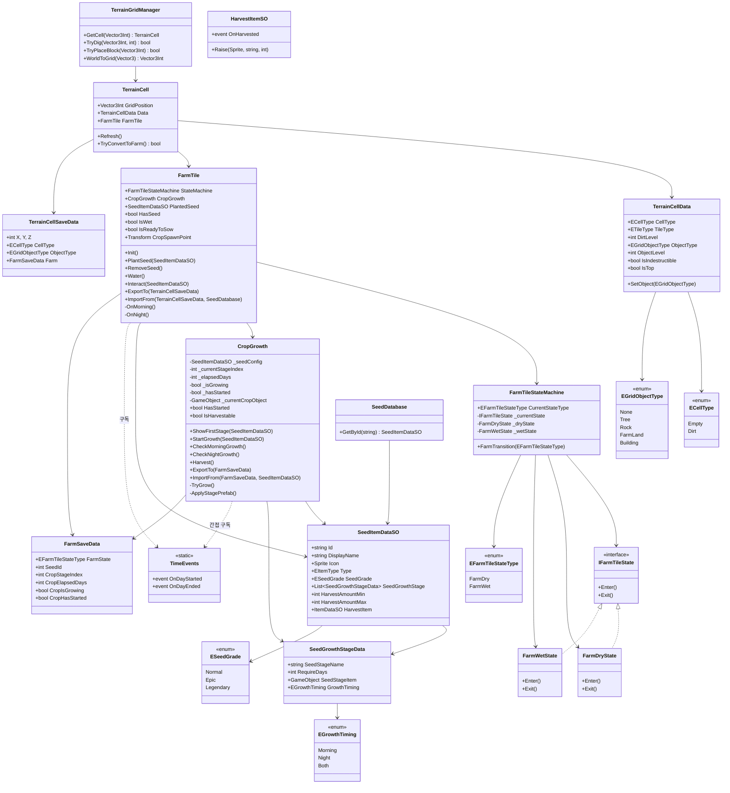

---

## 4. FarmTile 상태 머신

### 상태 정의

| 상태 | 설명 | 가능한 행동 |
|------|------|-----------|
| `FarmDry` | 건조한 농지. 씨앗 없으면 파종 가능. 씨앗 있으면 물주기 필요. | 파종, 물주기 |
| `FarmWet` | 물을 준 상태. 성장이 진행됨. 아침이 되면 자동 건조. | 수확(수확가능 시) |

### 상태 전이 다이어그램

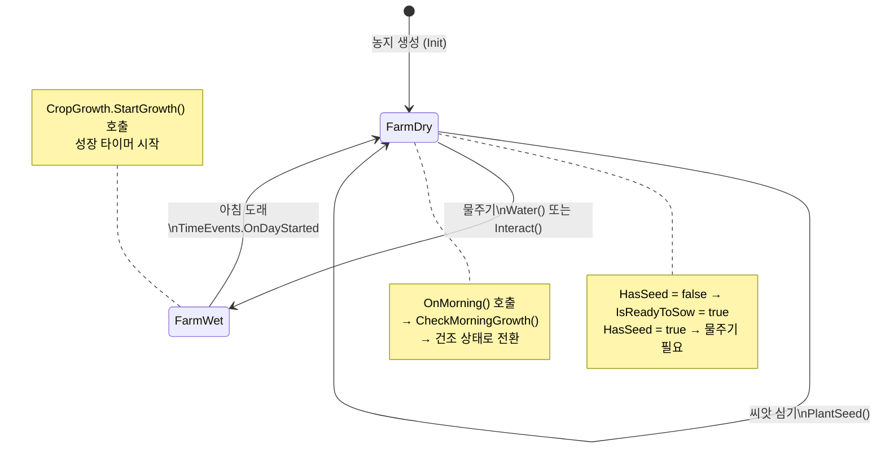

### FarmTile.Interact() 분기 로직

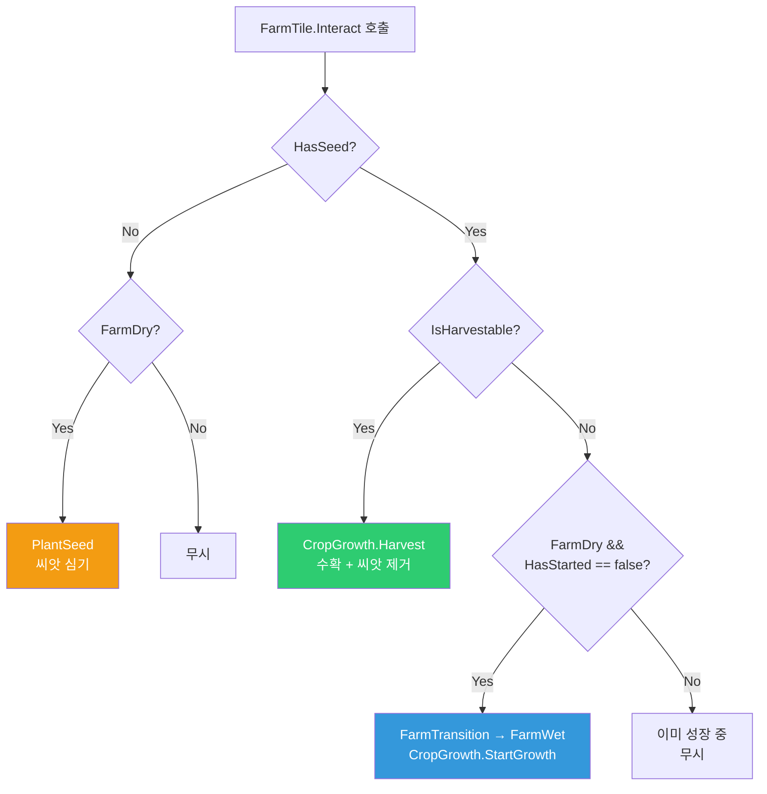

---

## 5. 작물 성장 시스템 (CropGrowth)

### 성장 단계 구조

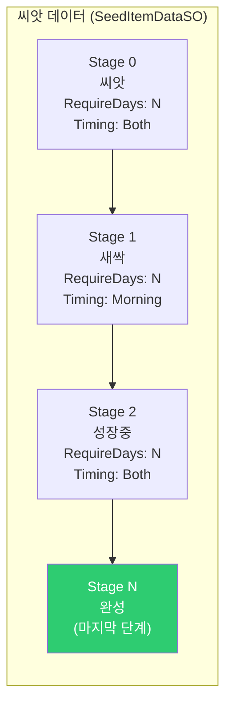

### CropGrowth 내부 상태

| 변수 | 타입 | 설명 |
|------|------|------|
| `_currentStageIndex` | int | 현재 성장 단계 인덱스 |
| `_elapsedDays` | int | 현재 단계에서 경과한 일수 |
| `_isGrowing` | bool | 성장 진행 중 여부 |
| `_hasStarted` | bool | 성장이 시작된 적 있는지 |
| `IsHarvestable` | bool | `!_isGrowing && _hasStarted` |

### TryGrow() 로직

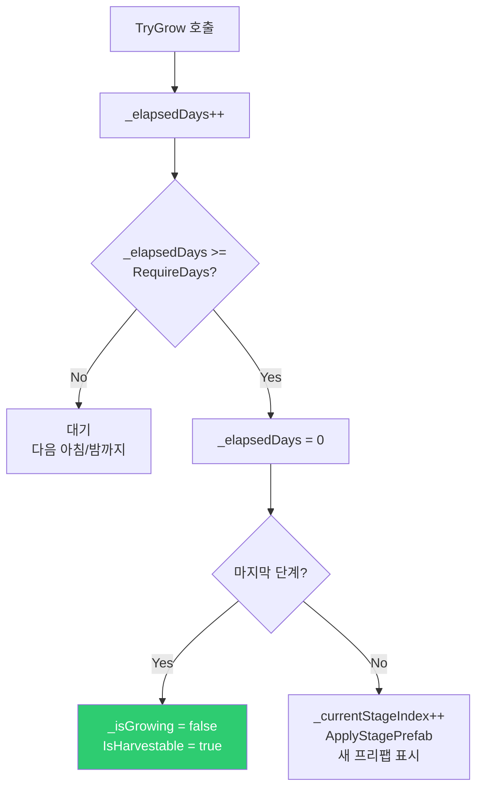

### 성장 타이밍 (EGrowthTiming)

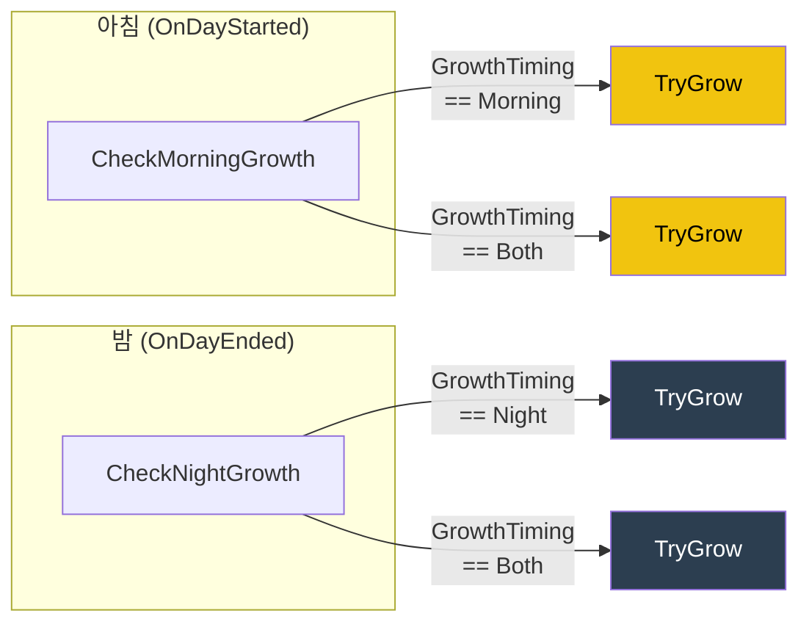

---

## 6. 씨앗 심기 → 수확 전체 흐름

### 전체 시퀀스 다이어그램

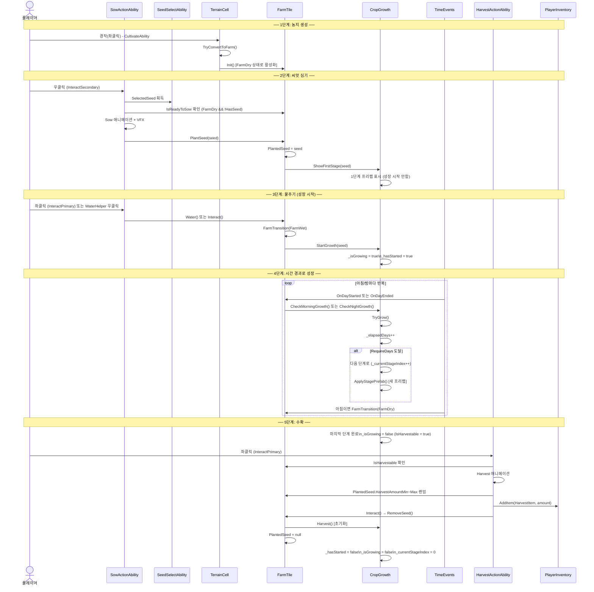

### 씨앗 심기 상세 (SowActionAbility)

```mermaid
flowchart TD
    RMB[우클릭\nInteractSecondary] --> CHECK1{FarmTile.IsReadyToSow?\nFarmDry && !HasSeed}
    CHECK1 -->|No| FAIL1[무시]
    CHECK1 -->|Yes| CHECK2{SeedSelectAbility\n.SelectedSeed != null?}
    CHECK2 -->|No| FAIL2[씨앗 없음 - 무시]
    CHECK2 -->|Yes| BEGIN[BeginAction\nIsActing = true]
    BEGIN --> ANIM[Sow 애니메이션 재생]
    ANIM --> SOWOPEN[SowOpen 콜백\n애니메이션 이벤트]
    SOWOPEN --> VFX[씨앗 VFX 생성/발사]
    VFX --> DELAY[0.5초 대기\n_sowDelay]
    DELAY --> PLANT[farmTile.PlantSeed(seed)]
    PLANT --> EXP[경험치 +10]
    EXP --> SOWCLOSE[SowClose 콜백]
    SOWCLOSE --> IDLE[Idle 애니메이션]
    IDLE --> END[EndAction]
```

### 수확 상세 (HarvestActionAbility)

```mermaid
flowchart TD
    LMB[좌클릭\nInteractPrimary] --> CHECK1{FarmTile != null?}
    CHECK1 -->|No| FAIL[무시]
    CHECK1 -->|Yes| CHECK2{HasSeed?}
    CHECK2 -->|No| FAIL
    CHECK2 -->|Yes| CHECK3{IsHarvestable?}
    CHECK3 -->|No| FAIL
    CHECK3 -->|Yes| BEGIN[BeginAction]
    BEGIN --> ANIM[Harvest 애니메이션]
    ANIM --> RAND[수확량 계산\nRandom.Range(Min, Max+1)]
    RAND --> ADDITEM[PlayerInventory.AddItem\n(HarvestItem, amount)]
    ADDITEM --> EXP[경험치 +10]
    EXP --> NOTIFY[HarvestItemSO.Raise\n수확 알림 UI 표시]
    NOTIFY --> REMOVE[farmTile.Interact\n→ RemoveSeed + CropGrowth.Harvest]
    REMOVE --> RESET[FarmTile 초기화\nPlantedSeed = null]
    RESET --> ENDB[EndAction]

    style ADDITEM fill:#2ecc71,color:#fff
```

---

## 7. 농지 변환 로직

### 지형 타입 계층

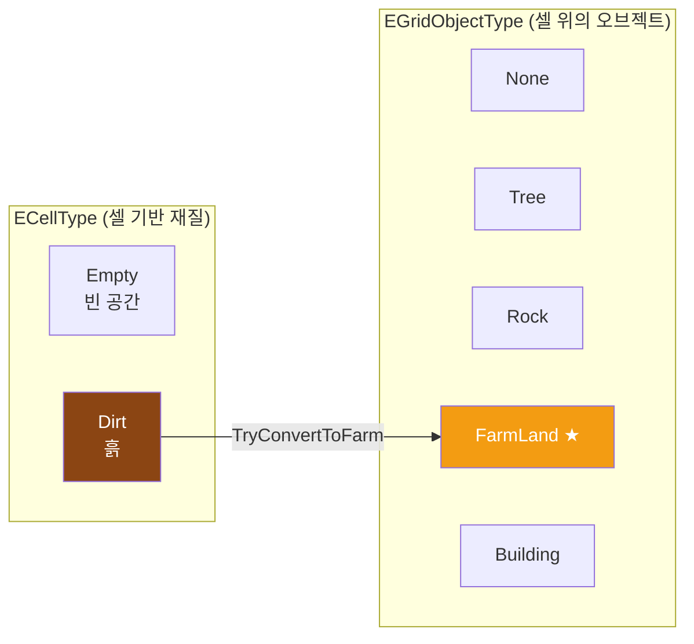

### 농지 변환 조건 및 흐름

```mermaid
flowchart TD
    CULTIVATE[CultivateAbility 또는 TillActionAbility\n좌클릭] --> CELL[TerrainCell.TryConvertToFarm]

    CELL --> C1{CellType == Dirt?}
    C1 -->|No| FAIL[변환 불가]
    C1 -->|Yes| C2{ObjectType == None?}
    C2 -->|No| FAIL
    C2 -->|Yes| C3{FarmTile 있음?}
    C3 -->|No| FAIL
    C3 -->|Yes| CONVERT[ObjectType = FarmLand]
    CONVERT --> REFRESH[TerrainCell.Refresh]
    REFRESH --> SHOW[farmTile.gameObject.SetActive(true)]
    SHOW --> INIT[FarmTile.Init\n→ FarmDry 상태로 시작]

    style INIT fill:#2ecc71,color:#fff
```

### 경작(CultivateAbility) Jump & Cultivate 흐름

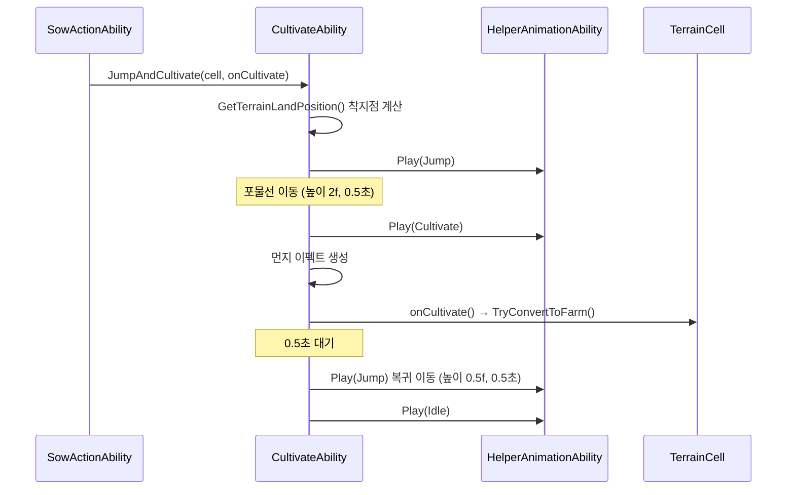

---

## 8. 시간 시스템과 성장 트리거

### 하루 주기 이벤트 흐름

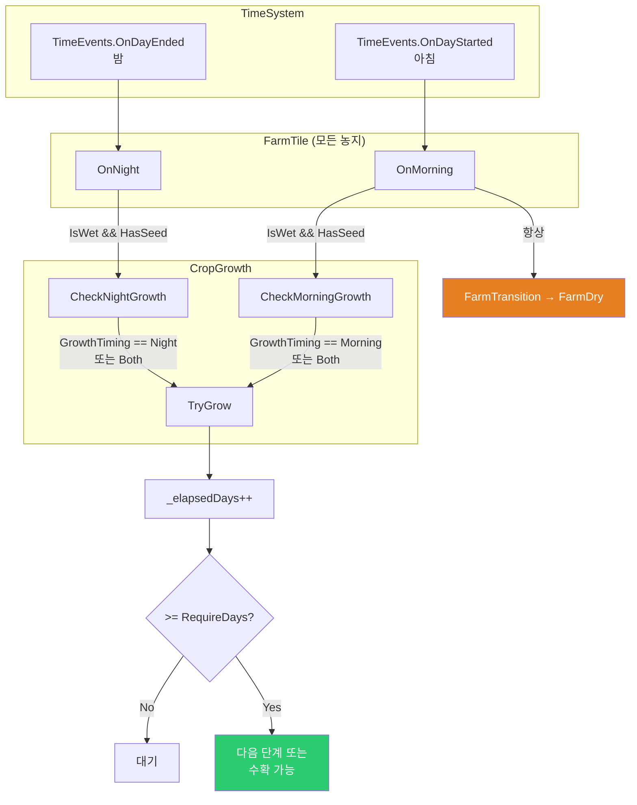

### 하루 1사이클 예시

```
[ 저녁 ] 플레이어가 물을 줌
  → FarmTile: FarmDry → FarmWet
  → CropGrowth.StartGrowth() 호출
  → _isGrowing = true, _elapsedDays = 0

[ 밤 ]  TimeEvents.OnDayEnded 발생
  → FarmTile.OnNight()
  → CropGrowth.CheckNightGrowth()
  → GrowthTiming == Night or Both → TryGrow()
  → _elapsedDays: 0 → 1

[ 아침 ] TimeEvents.OnDayStarted 발생
  → FarmTile.OnMorning()
  → CropGrowth.CheckMorningGrowth()
  → GrowthTiming == Morning or Both → TryGrow()
  → _elapsedDays: 1 → 2
  → FarmTile: FarmWet → FarmDry (물주기 필요)

[ 아침 ] 플레이어가 다시 물을 줌
  → FarmDry → FarmWet
  → CropGrowth.HasStarted == true → StartGrowth 재호출 안함
```

---

## 9. 씨앗 선택 시스템

### 씨앗 선택 흐름

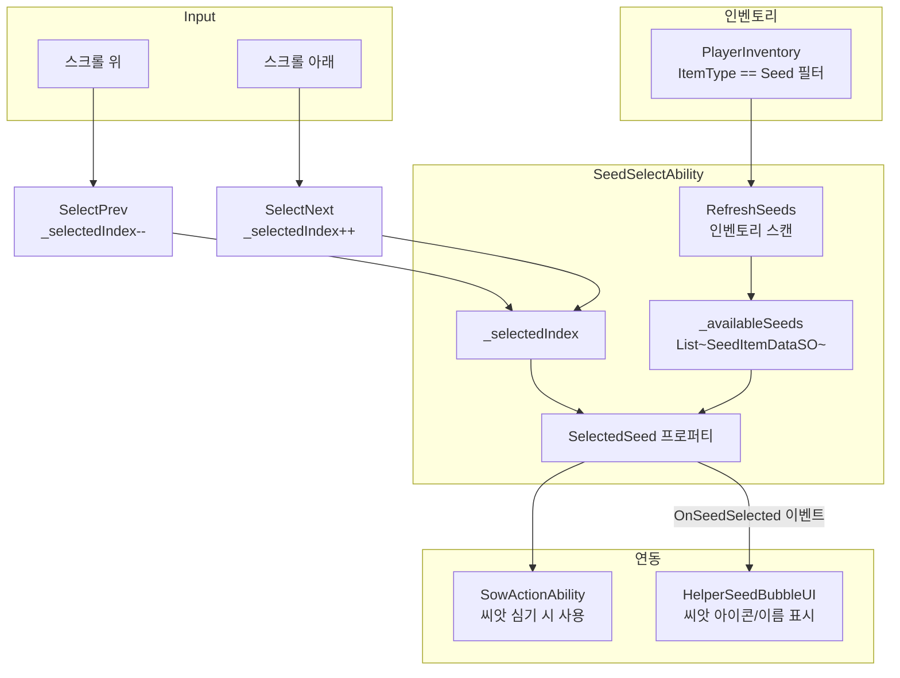

---

## 10. 수확 알림 시스템

```mermaid
flowchart LR
    HARV[HarvestActionAbility] -->|Raise(icon, name, amount)| HIS[HarvestItemSO\n이벤트 채널]
    HIS -->|OnHarvested 이벤트| MGR[HarvestNotification\nManager]
    MGR -->|Pool에서 UI 꺼냄| NOTIF[HarvestNotification\nUI 요소]
    NOTIF --> ICON[아이콘 표시]
    NOTIF --> TEXT["씨앗이름 x수량 표시"]
    NOTIF --> ANIM[위로 올라가며\n페이드아웃 애니메이션]
```

---

## 11. 지형/격자 시스템

### 셀 구성 요소

```mermaid
flowchart TD
    subgraph TerrainCell["TerrainCell (격자 한 칸)"]
        DATA[TerrainCellData\n셀 메타 데이터]
        DIRT_BLOCK[dirtBlock\n흙 블록 시각화]
        GRASS_BLOCK[grassBlock\n잔디 시각화]
        FARM_TILE[FarmTile\n농지 (비활성화 초기)]
        CURR_OBJ[CurrentObject\n나무/바위 등]
    end

    subgraph Refresh["Refresh() 조건"]
        R1["isDirt && !IsTop → dirtBlock 표시"]
        R2["isDirt && IsTop → grassBlock 표시"]
        R3["ObjectType == FarmLand → farmTile 활성화"]
    end

    TerrainCell --> Refresh
```

### 지형 관련 주요 연산

```mermaid
flowchart LR
    subgraph GridManager["TerrainGridManager"]
        GET[GetCell(Vector3Int)\n셀 조회]
        DIG[TryDig\n땅 파기]
        PLACE[TryPlaceBlock\n블록 배치]
        W2G[WorldToGrid\n좌표 변환]
    end

    subgraph GroundAction["GroundActionAbility"]
        PRIMARY[좌클릭: 파기\n흙 인벤토리에 추가]
        SECONDARY[우클릭: 채우기\n인벤토리 흙 소비]
    end

    PRIMARY --> DIG
    SECONDARY --> PLACE
    DIG --> RPC_DIG[RPC_Dig\n멀티 동기화]
    PLACE --> RPC_PLACE[RPC_PlaceBlock\n멀티 동기화]
```

---

## 12. 저장/로드 시스템

### 저장 데이터 구조도

```mermaid
flowchart TD
    subgraph GameSaveData["PlayerSaveData (최상위)"]
        TERRAIN[TerrainSaveData]
    end

    TERRAIN --> CELLS["List~TerrainCellSaveData~"]

    subgraph CellSave["TerrainCellSaveData (셀당 1개)"]
        XYZ["X, Y, Z (좌표)"]
        CELLTYPE[CellType]
        OBJTYPE[ObjectType]
        FARM[FarmSaveData\n(농지인 경우)]
    end

    CELLS --> CellSave

    subgraph FarmSave["FarmSaveData (농지 데이터)"]
        FS1[FarmState\nFarmDry / FarmWet]
        FS2[SeedId\n심어진 씨앗 ID]
        FS3[CropStageIndex\n현재 성장 단계]
        FS4[CropElapsedDays\n경과 일수]
        FS5[CropIsGrowing\n성장 중 여부]
        FS6[CropHasStarted\n시작 여부]
    end

    FARM --> FarmSave
```

### 저장 흐름

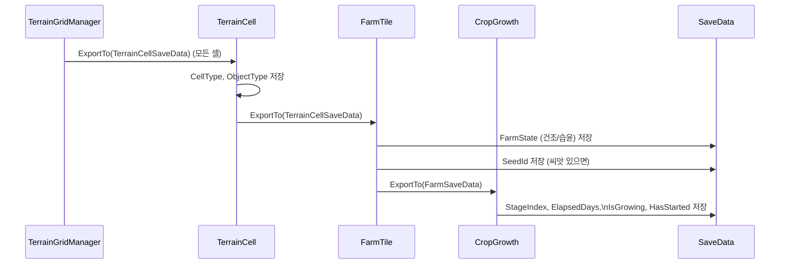

### 로드 흐름

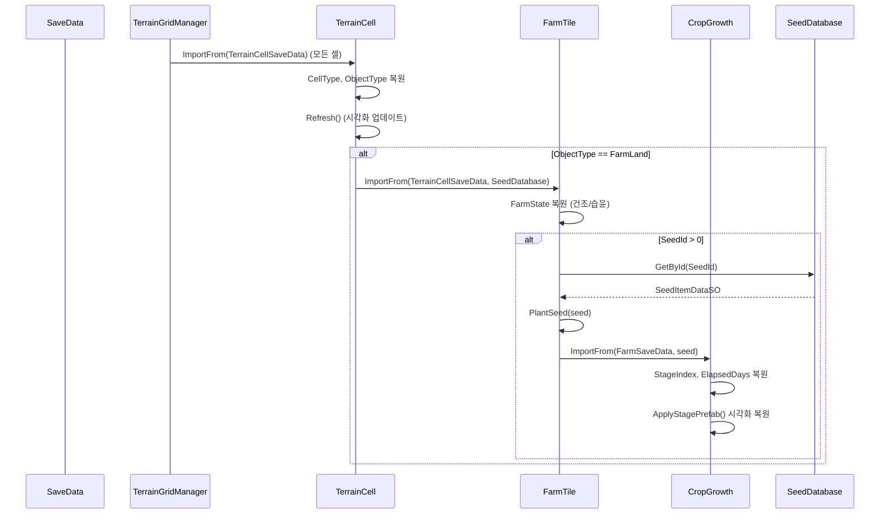

---

## 13. 데이터 구조

### SeedItemDataSO (씨앗 ScriptableObject)

| 필드 | 타입 | 설명 |
|------|------|------|
| Id | string | 고유 ID (저장/조회용) |
| DisplayName | string | 표시 이름 |
| Icon | Sprite | 아이콘 |
| Type | EItemType | `Seed` 고정 |
| SeedGrade | ESeedGrade | Normal / Epic / Legendary |
| SeedGrowthStage | List\<SeedGrowthStageData\> | 성장 단계 목록 |
| HarvestAmountMin | int | 최소 수확량 |
| HarvestAmountMax | int | 최대 수확량 |
| HarvestItem | ItemDataSO | 수확 시 얻는 아이템 |

### SeedGrowthStageData

| 필드 | 타입 | 설명 |
|------|------|------|
| SeedStageName | string | 단계 이름 (예: "새싹") |
| RequireDays | int | 이 단계 통과에 필요한 일수 |
| SeedStageItem | GameObject | 해당 단계의 시각화 프리팹 |
| GrowthTiming | EGrowthTiming | Morning / Night / Both |

### 씨앗 등급 (ESeedGrade)

| 등급 | 설명 |
|------|------|
| `Normal` | 일반 씨앗 |
| `Epic` | 에픽 씨앗 |
| `Legendary` | 전설 씨앗 |

### 성장 타이밍 (EGrowthTiming)

| 값 | 성장 시점 |
|----|---------|
| `Morning` | 아침에만 (OnDayStarted) |
| `Night` | 밤에만 (OnDayEnded) |
| `Both` | 아침 + 밤 모두 |

---

## 전체 시스템 의존성 요약

```mermaid
flowchart TD
    subgraph 플레이어_입력["플레이어/헬퍼 입력"]
        SOW[SowActionAbility\n파종]
        WATER[WaterActionAbility\n관수]
        HARV[HarvestActionAbility\n수확]
        CULT[CultivateAbility\n경작]
        GROUND[GroundActionAbility\n땅파기]
    end

    subgraph 농지["농지 레이어"]
        CELL[TerrainCell]
        FT[FarmTile\n상태: Dry/Wet]
        CG[CropGrowth\n성장 단계]
    end

    subgraph 데이터["데이터 레이어"]
        SDS[SeedItemDataSO\n씨앗 설정]
        SGSD[SeedGrowthStageData\n단계별 설정]
        DB[SeedDatabase]
    end

    subgraph 시간["시간 시스템"]
        TIME[TimeEvents\nOnDayStarted / OnDayEnded]
    end

    subgraph 저장["저장/로드"]
        SAVE[FarmSaveData\nTerrainCellSaveData]
    end

    subgraph UI["UI"]
        NOTIFY[HarvestNotification\n수확 알림]
        BUBBLE[HelperSeedBubbleUI\n씨앗 선택 표시]
    end

    CULT --> CELL
    SOW --> FT
    WATER --> FT
    HARV --> FT

    FT --> CG
    CELL --> FT

    CG --> SDS
    SDS --> SGSD
    DB --> SDS

    TIME --> FT
    FT --> CG

    FT --> SAVE
    CG --> SAVE
    SAVE --> DB

    HARV --> NOTIFY
    SOW --> BUBBLE
```

---

*이 문서는 농사/작물 성장 시스템의 설계 및 구현을 기반으로 작성되었습니다.*
