# Helper(곡룡) 시스템 문서

> 작성일: 2026-04-01  
> 브랜치: feat/sj/helper-upgrade-system

---

## 목차

1. [시스템 개요](#1-시스템-개요)
2. [디렉토리 구조](#2-디렉토리-구조)
3. [클래스 계층 다이어그램](#3-클래스-계층-다이어그램)
4. [헬퍼 상태 머신](#4-헬퍼-상태-머신)
5. [헬퍼 종류 및 기능](#5-헬퍼-종류-및-기능)
6. [핵심 컴포넌트 상세](#6-핵심-컴포넌트-상세)
7. [생성 및 소환 흐름](#7-생성-및-소환-흐름)
8. [장착/해제 흐름](#8-장착해제-흐름)
9. [상호작용 흐름 (좌/우클릭)](#9-상호작용-흐름-좌우클릭)
10. [경험치 및 업그레이드 시스템](#10-경험치-및-업그레이드-시스템)
11. [에너지 시스템](#11-에너지-시스템)
12. [네트워크 동기화](#12-네트워크-동기화-photon-pun2)
13. [저장/로드 시스템](#13-저장로드-시스템)
14. [UI 시스템](#14-ui-시스템)
15. [데이터 구조](#15-데이터-구조)
16. [인터페이스 정의](#16-인터페이스-정의)

---

## 1. 시스템 개요

Helper(곡룡) 시스템은 플레이어를 도와주는 동료 공룡 시스템입니다.  
각 헬퍼는 고유한 능력(Action)을 갖고 있으며, 소환/장착 상태에서 플레이어의 좌클릭·우클릭 입력에 반응하여 농사, 벌목, 채굴 등의 작업을 자동으로 수행합니다.

**핵심 특징**
- 3가지 상태 관리: `Inventory` / `Summoned` / `Equipped`
- Ability 컴포넌트 조합으로 헬퍼 기능 구성 (모듈식 설계)
- 경험치 누적 → 등급 업그레이드 (`Normal → Epic → Legendary`)
- Photon PUN2 RPC로 멀티플레이어 동기화
- 헬퍼 전환 시 이전 상태(레벨·등급·경험치) 자동 저장/복원

---

## 2. 디렉토리 구조

```
Assets/02.Scripts/InGame/Helper/
├── Core/                          # 헬퍼 중추 시스템
│   ├── HelperController.cs        # 메인 컨트롤러
│   ├── EHelperState.cs            # 상태 열거형
│   ├── EHelperAnim.cs             # 애니메이션 열거형
│   ├── HelperLevel.cs             # 레벨 관리
│   ├── HelperGrade.cs             # 등급 관리
│   ├── HelperEnergy.cs            # 에너지 관리
│   └── IEquipOverride.cs          # 장착 커스터마이즈 인터페이스
│
├── Abilities/                     # 공통 Ability (이동, 애니메이션, 상호작용)
│   ├── HelperAbility.cs           # Ability 기본 클래스
│   ├── HelperFollowAbility.cs     # 플레이어 추적 이동
│   ├── HelperAnimationAbility.cs  # Animator 제어
│   ├── HelperInteractionAbility.cs# 상호작용 중개자
│   └── FarmBaseAbility.cs         # 농사 액션 기본 클래스
│
├── Actions/                       # 헬퍼별 고유 Action
│   ├── SowActionAbility.cs        # 파종 곡룡
│   ├── HarvestActionAbility.cs    # 수확 곡룡
│   ├── WaterActionAbility.cs      # 관수 곡룡
│   ├── CultivateAbility.cs        # 경작 (Jump & Cultivate)
│   ├── TillActionAbility.cs       # 개간 곡룡
│   ├── SeedSelectAbility.cs       # 씨앗 선택기
│   ├── GroundActionAbility.cs     # 땅 파기/채우기
│   ├── WoodCuttingMineActionAbility.cs  # 벌목/채굴
│   ├── LightActionAbility.cs      # 조명 (빛 헬퍼)
│   └── FarmHelperActionAbility.cs # 통합 농사 액션
│
├── Effects/                       # VFX 및 이펙트
│   ├── StoneMineAbility.cs        # 채굴 (Jump & Smash)
│   ├── HelperVfx.cs               # VFX 기본
│   └── IWaterEffect.cs            # 물 이펙트 인터페이스
│
├── Upgrade/                       # 경험치 및 업그레이드
│   └── HelperExperience.cs        # 경험치 관리
│
├── UI/                            # UI 연동
│   ├── UI_HelperInventory.cs      # 헬퍼 인벤토리 UI (카로셀)
│   ├── UI_HelperExperience.cs     # 경험치 바 UI
│   ├── UI_HelperActionInfo.cs     # 행동 설명 UI
│   └── HelperSeedBubbleUI.cs      # 씨앗 선택 표시 UI
│
├── Data/                          # 데이터 정의
│   ├── HelperDataSO.cs            # 헬퍼 설정 ScriptableObject
│   └── HelperDatabase.cs          # 헬퍼 ID 기반 검색
│
└── Interfaces/                    # 인터페이스
    ├── IHelper.cs
    └── IHelperAction.cs

Assets/02.Scripts/InGame/Player/Abilities/
├── PlayerHelperInventoryAbility.cs   # 플레이어 헬퍼 인벤토리
└── PlayerHelperInteractionAbility.cs # 플레이어-헬퍼 상호작용

Assets/02.Scripts/OutGame/Save/Data/
└── HelperSaveData.cs              # 저장 데이터 구조
```

---

## 3. 클래스 계층 다이어그램

```mermaid
classDiagram
    direction TB

    class MonoBehaviour

    %% === Core ===
    class HelperController {
        +EHelperState State
        +PlayerController PlayerOwner
        +Transform FollowTarget
        +bool IsActing
        +bool IsMine
        +HelperLevel Level
        +HelperGrade Grade
        +HelperEnergy Energy
        +HelperExperience Experience
        +PhotonView PhotonView
        +Summon(PlayerController)
        +Equip(Transform)
        +Unequip()
        +BeginAction()
        +EndAction()
        +InteractPrimary(TerrainCell)
        +InteractSecondary(TerrainCell)
        +GetAbility~T~()
    }

    class HelperLevel {
        +int Current
        +int MaxLevel
        +LevelUp()
        +GetEnergyCost() float
    }

    class HelperGrade {
        +EHelperGrade Current
        +int GetRange()
        +Upgrade()
    }

    class HelperEnergy {
        +float Current
        +float Max
        +bool IsExhausted
        +TryConsume(float) bool
        +Recover(float)
        +RecoverFull()
        +OnExhausted event
        +OnRecovered event
    }

    class HelperExperience {
        +int CurrentExp
        +int MaxExp
        +bool IsReadyToUpgrade
        +Add(int)
        +Reset()
        +Load(int)
        +OnExpChanged event
        +OnReadyToUpgrade event
    }

    %% === Ability Base ===
    class HelperAbility {
        #HelperController _owner
    }

    class FarmBaseAbility {
        #GetFarmTile(TerrainCell) FarmTile
        +InteractPrimary(TerrainCell)*
        +InteractSecondary(TerrainCell)*
    }

    %% === Common Abilities ===
    class HelperFollowAbility {
        -float _moveSpeed
        -float _stopDistance
        -float _teleportDistance
        +LaunchBack()
    }

    class HelperAnimationAbility {
        +Play(EHelperAnim)
        +PlayLocal(EHelperAnim)
        +RPC_PlayAnimation(int)
    }

    class HelperInteractionAbility {
        +InteractPrimary(TerrainCell)
        +InteractSecondary(TerrainCell)
        +CanInteract() bool
        +RPC_InteractPrimary(int,int,int)
        +RPC_InteractSecondary(int,int,int)
    }

    %% === Action Abilities ===
    class SowActionAbility {
        -int _cultivateExperience
        -int _sowExperience
        -float _sowDelay
        +InteractPrimary(TerrainCell)
        +InteractSecondary(TerrainCell)
        +SowOpen()
        +SowClose()
    }

    class HarvestActionAbility {
        +InteractPrimary(TerrainCell)
    }

    class WaterActionAbility {
        +InteractPrimary(TerrainCell)
        +InteractSecondary(TerrainCell)
        +WaterOpen()
    }

    class CultivateAbility {
        -float _jumpHeight
        -float _jumpDuration
        +JumpAndCultivate(TerrainCell, Action)
    }

    class TillActionAbility {
        +InteractPrimary(TerrainCell)
    }

    class GroundActionAbility {
        +InteractPrimary(TerrainCell)
        +InteractSecondary(TerrainCell)
        +RPC_Dig(int,int,int,int)
        +RPC_PlaceBlock(int,int,int,int,int)
    }

    class WoodCuttingMineActionAbility {
        +InteractPrimary(TerrainCell)
        +InteractSecondary(TerrainCell)
    }

    class LightActionAbility {
        -float _transitionSpeed
        +GetEquipRotation() Vector3
        +GetEquipScale() float
    }

    class StoneMineAbility {
        -float _jumpHeight
        +JumpAndSmash(TerrainCell)
    }

    class SeedSelectAbility {
        -List~SeedItemDataSO~ _availableSeeds
        -int _selectedIndex
        +SelectNext()
        +SelectPrev()
        +OnSeedSelected event
    }

    %% === Player Abilities ===
    class PlayerHelperInventoryAbility {
        -List~HelperDataSO~ _helperDataList
        -int _currentIndex
        -HelperController _activeHelper
        +Rotate(int)
        +ToggleSummon()
        +AddHelper(HelperDataSO)
        +ExportTo(PlayerSaveData)
        +ImportFrom(PlayerSaveData)
    }

    class PlayerHelperInteractionAbility {
        -HelperController _currentHelper
        -HelperController _backHelper
        +Summon(HelperController)
        +Unsummon()
        +ToggleEquip()
        +TryInteractPrimary()
        +TryInteractSecondary()
    }

    %% === Data ===
    class HelperDataSO {
        +string HelperId
        +string HelperName
        +Sprite HelperIcon
        +float MaxEnergy
        +float EnergyRecoveryPerSecond
        +int MaxLevel
        +float BaseEnergyCost
        +float EnergyReducePerLevel
    }

    class HelperSaveData {
        +string HelperId
        +int Level
        +int Grade
        +int Experience
    }

    %% === Interfaces ===
    class IHelperAction {
        <<interface>>
        +InteractPrimary(TerrainCell)
        +InteractSecondary(TerrainCell)
    }

    class IEquipOverride {
        <<interface>>
        +GetEquipRotation() Vector3
        +GetEquipScale() float
    }

    class IWaterEffect {
        <<interface>>
        +CanHandle(TerrainCell) bool
        +Apply(TerrainCell)
    }

    %% === 상속 관계 ===
    MonoBehaviour <|-- HelperController
    MonoBehaviour <|-- HelperAbility
    HelperAbility <|-- HelperFollowAbility
    HelperAbility <|-- HelperAnimationAbility
    HelperAbility <|-- HelperInteractionAbility
    HelperAbility <|-- FarmBaseAbility
    FarmBaseAbility <|-- SowActionAbility
    FarmBaseAbility <|-- HarvestActionAbility
    FarmBaseAbility <|-- WaterActionAbility
    FarmBaseAbility <|-- TillActionAbility
    HelperAbility <|-- CultivateAbility
    HelperAbility <|-- GroundActionAbility
    HelperAbility <|-- WoodCuttingMineActionAbility
    HelperAbility <|-- LightActionAbility
    HelperAbility <|-- SeedSelectAbility
    HelperAbility <|-- StoneMineAbility

    %% === 구현 관계 ===
    SowActionAbility ..|> IHelperAction
    HarvestActionAbility ..|> IHelperAction
    WaterActionAbility ..|> IHelperAction
    TillActionAbility ..|> IHelperAction
    GroundActionAbility ..|> IHelperAction
    WoodCuttingMineActionAbility ..|> IHelperAction
    LightActionAbility ..|> IEquipOverride
    WaterActionAbility ..|> IWaterEffect

    %% === 의존 관계 ===
    HelperController --> HelperLevel
    HelperController --> HelperGrade
    HelperController --> HelperEnergy
    HelperController --> HelperExperience
    HelperController --> HelperDataSO
    PlayerHelperInventoryAbility --> HelperController
    PlayerHelperInteractionAbility --> HelperController
    HelperInteractionAbility --> IHelperAction
    SowActionAbility --> CultivateAbility
    WoodCuttingMineActionAbility --> StoneMineAbility
```

---

## 4. 헬퍼 상태 머신

### 상태 정의 (EHelperState)

| 상태 | 설명 |
|------|------|
| `Inventory` | 인벤토리에 있는 상태. GameObject 비활성화. |
| `Summoned` | 소환되어 플레이어를 따라다니는 상태. |
| `Equipped` | 플레이어 어깨/등에 장착된 상태. 이동 불가, 플레이어와 함께 움직임. |

### 상태 전이 다이어그램

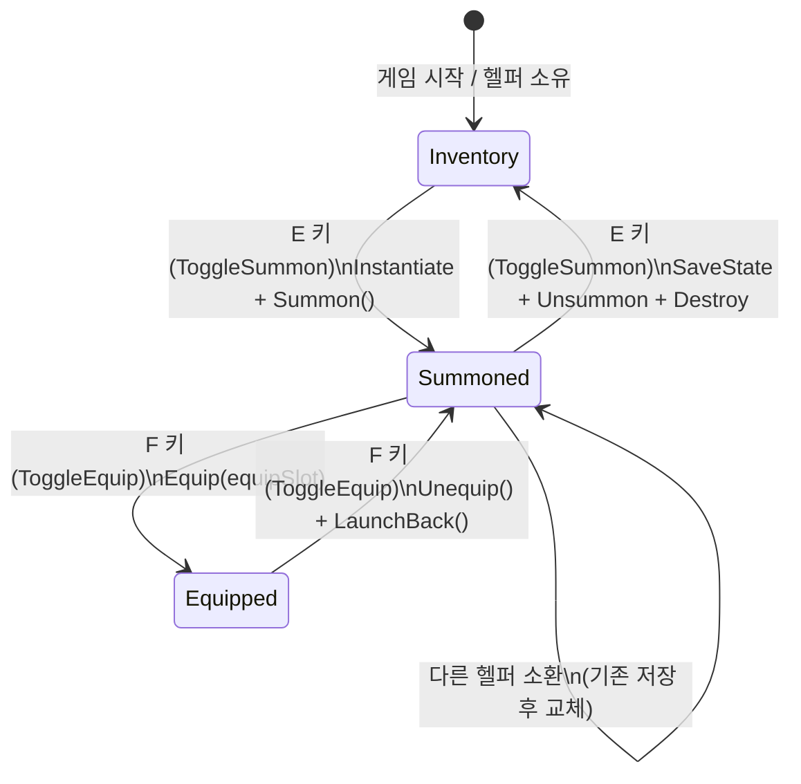

### 상태별 컴포넌트 동작

```mermaid
flowchart LR
    subgraph Inventory["Inventory 상태"]
        I1[GameObject 비활성화]
        I2[HelperFollowAbility 정지]
        I3[조명 OFF - LightHelper]
    end

    subgraph Summoned["Summoned 상태"]
        S1[GameObject 활성화]
        S2[HelperFollowAbility 추적 시작]
        S3[PhotonTransformView 동기화]
        S4[조명 - 헬퍼 머리 위 5f, 범위 5f]
    end

    subgraph Equipped["Equipped 상태"]
        E1[transform.SetParent(equipSlot)]
        E2[PhotonTransformView 동기화 OFF]
        E3[IEquipOverride로 위치/스케일 조정]
        E4[Equipped 애니메이션]
        E5[조명 - 플레이어 머리 위, 범위 20f]
    end

    Inventory --> |E키| Summoned
    Summoned --> |F키| Equipped
    Equipped --> |F키| Summoned
    Summoned --> |E키| Inventory
```

---

## 5. 헬퍼 종류 및 기능

### 헬퍼 목록

| 헬퍼명 | 좌클릭 (Primary) | 우클릭 (Secondary) | 특이사항 |
|--------|-----------------|-------------------|---------|
| **파종 곡룡** | 경작 (Ground → FarmDry) | 파종 (FarmDry → 씨앗 심기) | CultivateAbility + SowActionAbility 조합 |
| **수확 곡룡** | 수확 (Harvestable → 아이템 획득) | 미구현 | 수확량: Random(Min~Max) |
| **관수 곡룡** | 물주기 (FarmDry → FarmWet) | 얼음 뿌리기 (LavaToStone) | Secondary 추가 에너지 25 소비 |
| **개간 곡룡** | 개간 (Ground → FarmDry) | 미구현 | TillActionAbility |
| **땅파기 곡룡** | 땅 파기 (흙 획득) | 땅 채우기 (흙 소비) | GroundActionAbility |
| **벌목/채굴 곡룡** | 벌목 (나무 채집) | 채굴 (돌 채집, Jump & Smash) | WoodCuttingMineActionAbility + StoneMineAbility |
| **빛 곡룡** | 없음 | 없음 | 장착 시 조명 대폭 강화 (IEquipOverride) |

### 헬퍼별 Action 컴포넌트 조합

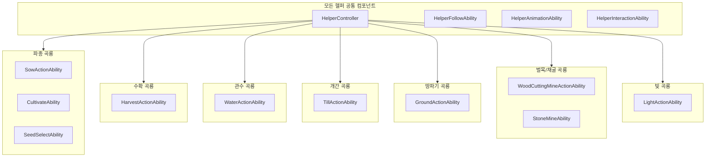

---

## 6. 핵심 컴포넌트 상세

### 6.1 HelperController

헬퍼의 중추 컨트롤러. 모든 Ability의 허브 역할.

```
주요 책임:
- 상태 관리 (Inventory / Summoned / Equipped)
- Ability 캐시 (GetAbility<T>()로 O(1) 접근)
- 행동 플래그 관리 (IsActing)
- 네트워크 소유권 확인 (IsMine)
- RPC 발신/수신 (Summon, Equip, Unequip)
```

### 6.2 HelperFollowAbility (이동 추적)

```
이동 로직:
┌─────────────────────────────────────────────────────────┐
│ 거리 > TeleportDistance(8f) 또는 높이차 > 1.8f           │
│   └─ 1초 딜레이 후 플레이어 옆으로 텔레포트              │
│                                                         │
│ 거리 > SlowDownDistance(3f)                              │
│   └─ 최대 속도(4f)로 이동                                │
│                                                         │
│ StopDistance(2.5f) < 거리 <= SlowDownDistance(3f)        │
│   └─ 속도 감소하며 이동                                  │
│                                                         │
│ 거리 <= StopDistance(2.5f)                               │
│   └─ 정지                                               │
│                                                         │
│ 앞에 벽 && 위가 비어있으면 자동 점프                      │
└─────────────────────────────────────────────────────────┘

LaunchBack(): 장착 해제 시 뒤로 날아가는 효과
  - jumpForce: 5f, backForce: 3f
```

### 6.3 HelperInteractionAbility (상호작용 중개자)

```
CanInteract() 검사 순서:
1. IsActing == true → false (이미 행동 중)
2. Energy.IsExhausted → false (에너지 없음)
3. IHelperAction == null → false (액션 없음)
4. PlayerStamina 부족 → false (플레이어 스태미나 없음)
5. 모두 통과 → true

상호작용 실행 순서:
BeginAction() → Action.Interact() → Energy.TryConsume() → RPC 전송 → EndAction()
```

### 6.4 CultivateAbility / StoneMineAbility (Jump & Action 패턴)

두 Ability 모두 동일한 Jump & Action 패턴 사용:

```
JumpCoroutine 흐름:
1. 착지점 계산 (TerrainLandPosition)
2. Jump 애니메이션으로 목표 위치까지 포물선 이동 (0.5초)
3. Action 애니메이션 (Cultivate / Stun)
4. VFX 생성 (먼지 / 돌 이펙트)
5. 콜백 실행 (경작 / 채굴)
6. 0.5초 대기
7. Jump 애니메이션으로 원래 위치로 복귀 (낮은 점프 0.5f)
8. Idle 애니메이션으로 전환
```

### 6.5 LightActionAbility (빛 헬퍼)

```
상태별 조명 설정:

Summoned:
  position  = Vector3.up × 5f (헬퍼 머리 위)
  range     = 5f
  intensity = 2f

Equipped:
  position  = 플레이어 머리 위 + 5f (forward offset -1.4f)
  range     = 20f
  intensity = 100f

Inventory:
  Light 비활성화

전환: Lerp(transitionSpeed: 2f)로 부드럽게 변경

IEquipOverride:
  GetEquipRotation() = (0, 180, 0)
  GetEquipScale()    = 0.55f
```

---

## 7. 생성 및 소환 흐름

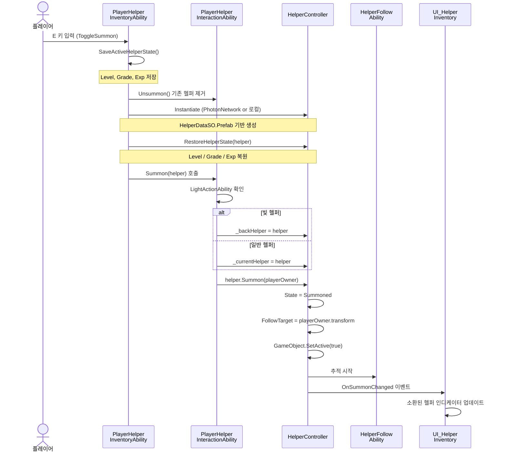

---

## 8. 장착/해제 흐름

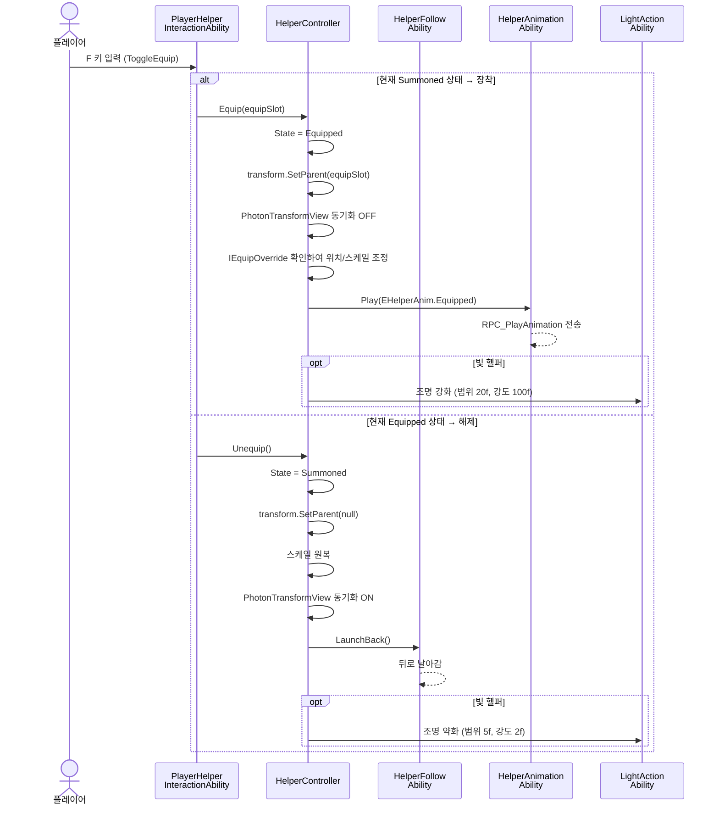

---

## 9. 상호작용 흐름 (좌/우클릭)

### 전체 흐름

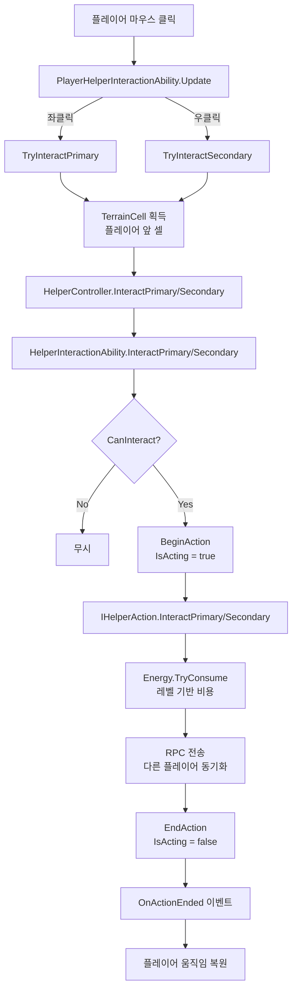

### 파종 곡룡 우클릭 (파종) 상세

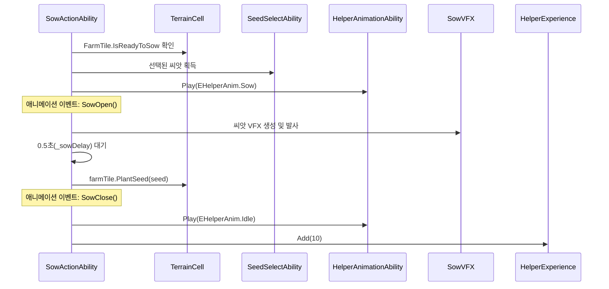

### 관수 곡룡 우클릭 (얼음) 상세

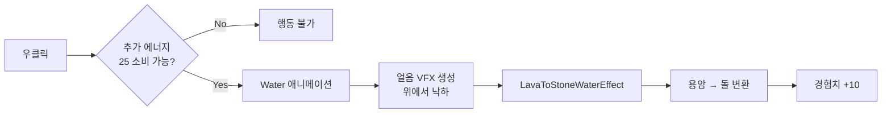

---

## 10. 경험치 및 업그레이드 시스템

### 경험치 획득 테이블

| 행동 | 경험치 | 담당 클래스 |
|------|--------|------------|
| 경작 (Cultivate) | +10 | SowActionAbility |
| 파종 (Sow) | +10 | SowActionAbility |
| 수확 (Harvest) | +10 | HarvestActionAbility |
| 물주기 (Water) | +10 | WaterActionAbility |
| 벌목/채굴 | GatheringInfo로 전달 | WoodCuttingMineActionAbility |

### 등급 시스템 (HelperGrade)

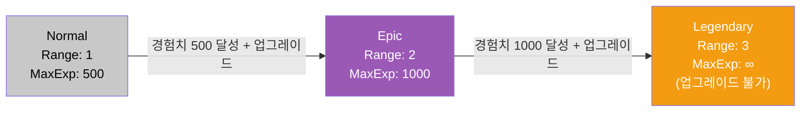

### 업그레이드 흐름

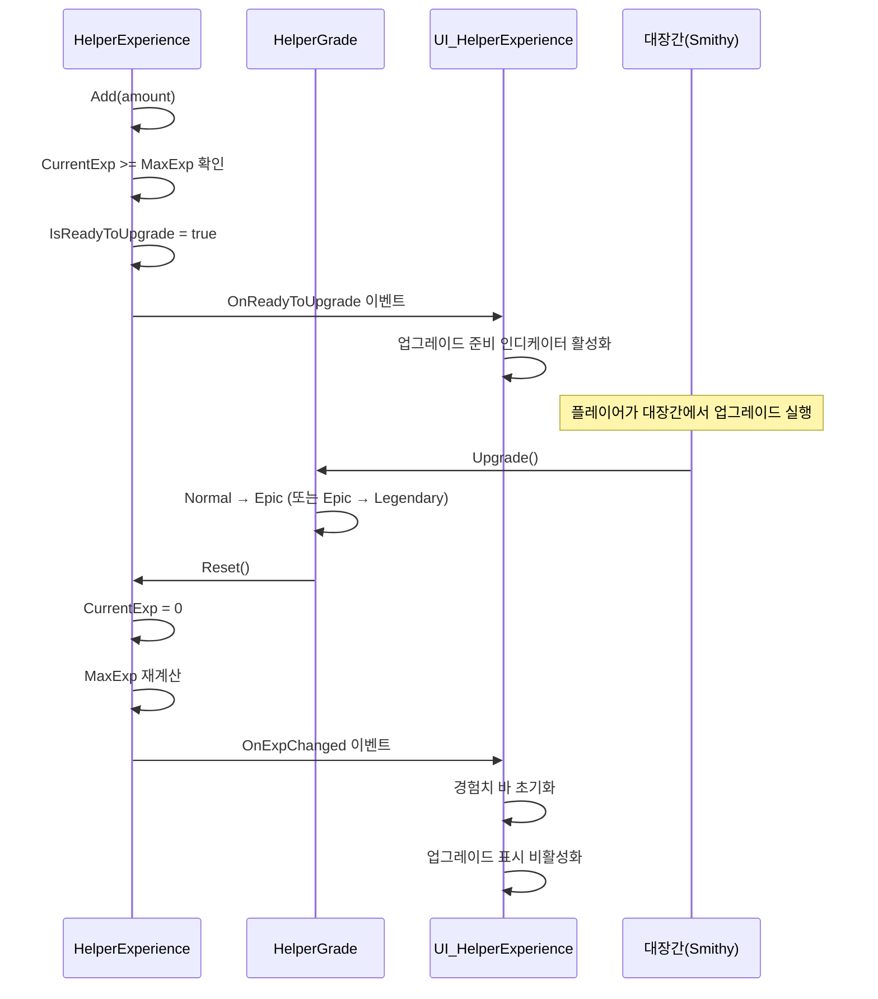

### 경험치 바 업데이트 로직

```
fillAmount = CurrentExp / MaxExp
애니메이션: 0.5초 Tween으로 부드럽게 채움
업그레이드 가능 시: _upgradeReadyIndicator 활성화
헬퍼 해제 시: fillAmount = 0으로 즉시 초기화
```

---

## 11. 에너지 시스템

### 에너지 소비 공식

```
행동당 에너지 비용 = Max(1f, BaseEnergyCost - (EnergyReducePerLevel × (Level - 1)))

예시 (BaseEnergyCost=10, EnergyReducePerLevel=1):
  Level 1  → 10 - (1 × 0) = 10
  Level 5  → 10 - (1 × 4) = 6
  Level 10 → 10 - (1 × 9) = 1 (최소 1)
```

### 에너지 흐름

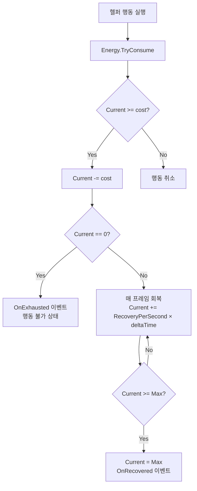

---

## 12. 네트워크 동기화 (Photon PUN2)

### RPC 목록

| 클래스 | RPC 메서드 | 전달 데이터 | 방향 |
|--------|-----------|------------|------|
| HelperController | RPC_Summon | ownerViewId | All |
| HelperController | RPC_Equip | ownerViewId | All |
| HelperController | RPC_Unequip | - | All |
| HelperAnimationAbility | RPC_PlayAnimation | anim (int) | All |
| HelperInteractionAbility | RPC_InteractPrimary | gridX, gridY, gridZ | Others |
| HelperInteractionAbility | RPC_InteractSecondary | gridX, gridY, gridZ | Others |
| SowActionAbility | RPC_PlantSeed | gridX, gridY, gridZ, seedId | Others |
| GroundActionAbility | RPC_Dig | gridX, gridY, gridZ, toolLevel | Others |
| GroundActionAbility | RPC_PlaceBlock | gridX, gridY, gridZ, tileType, dirtLevel | Others |

### 동기화 패턴

```mermaid
flowchart LR
    subgraph LOCAL["로컬 플레이어 (IsMine = true)"]
        INPUT[입력 감지] --> EXEC[로컬 실행]
        EXEC --> RPC[RPC 발송]
    end

    subgraph REMOTE["원격 플레이어 (IsMine = false)"]
        RPC_RECV[RPC 수신] --> EXEC_R[로컬 실행\n(시각적 동기화)]
    end

    RPC --> RPC_RECV
```

---

## 13. 저장/로드 시스템

### 저장 데이터 구조

```csharp
// HelperSaveData
{
    HelperId:   string  // 헬퍼 고유 ID
    Level:      int     // 현재 레벨
    Grade:      int     // 0=Normal, 1=Epic, 2=Legendary
    Experience: int     // 현재 경험치
}
```

### 저장 흐름

```mermaid
flowchart TD
    TRIGGER[저장 트리거\n헬퍼 전환 또는 게임 종료] --> SAVE_ACTIVE[SaveActiveHelperState]
    SAVE_ACTIVE --> STORE[_savedStates 딕셔너리에 저장\nHelperId → HelperSaveData]
    STORE --> EXPORT[ExportTo(PlayerSaveData)]
    EXPORT --> LOOP[소유 헬퍼 전체 순회]
    LOOP --> CHECK{저장 데이터 있음?}
    CHECK -->|Yes| USE_SAVED[저장된 상태 사용]
    CHECK -->|No| USE_DEFAULT[기본값 사용\nLevel=1, Grade=0, Exp=0]
    USE_SAVED --> APPEND[saveData.Helpers에 추가]
    USE_DEFAULT --> APPEND
```

### 로드 흐름

```mermaid
flowchart TD
    IMPORT[ImportFrom(PlayerSaveData)] --> LOOP[저장된 헬퍼 순회]
    LOOP --> DB[HelperDatabase.GetById 조회]
    DB --> REG[_savedStates에 등록]
    REG --> NEW{기존 미소유 헬퍼?}
    NEW -->|Yes| ADD[_helperDataList에 추가]
    NEW -->|No| SKIP[스킵]
    ADD --> ACTIVE{현재 활성 헬퍼?}
    ACTIVE -->|Yes| RESTORE[RestoreHelperState 즉시 복원]
    ACTIVE -->|No| WAIT[다음 소환 시 복원]
```

---

## 14. UI 시스템

### UI 컴포넌트 관계

```mermaid
flowchart TB
    subgraph UILayer["UI Layer"]
        INV[UI_HelperInventory\n헬퍼 카로셀 (Left/Center/Right)]
        EXP[UI_HelperExperience\n경험치 바 + 업그레이드 표시]
        ACT[UI_HelperActionInfo\n좌/우클릭 행동 설명]
        SEED[HelperSeedBubbleUI\n선택된 씨앗 표시]
    end

    subgraph CoreLayer["Core Layer"]
        PHIA[PlayerHelperInventoryAbility]
        PHIGA[PlayerHelperInteractionAbility]
        HC[HelperController]
        HE[HelperExperience]
        SS[SeedSelectAbility]
    end

    PHIA -->|OnSelectionChanged| INV
    PHIA -->|OnSummonChanged| INV
    HC -->|소환 시 연결| EXP
    HE -->|OnExpChanged| EXP
    HE -->|OnReadyToUpgrade| EXP
    INV -->|Center 헬퍼 변경| ACT
    SS -->|OnSeedSelected| SEED
```

### UI_HelperInventory (카로셀)

```
레이아웃:
  [Left(0.5x)] [Center(1.7x)] [Right(1.0x)]

동작:
  1, 3 키 입력 → Rotate() → 슬라이드 애니메이션
  소환된 헬퍼 → SummonedIndicator 표시
  자동 숨김: 3초 후 축소

확장(Show) 시:
  - SideDecors: 회색으로 표시
  - CenterDecor: 숨김
  - HelperNameText: 표시
  - ActionInfoPanel: 표시

축소(Hide) 시:
  - 역방향
```

---

## 15. 데이터 구조

### HelperDataSO (ScriptableObject 설정)

| 필드 | 타입 | 설명 |
|------|------|------|
| HelperId | string | 고유 ID (저장/조회용) |
| HelperName | string | 표시 이름 |
| HelperIcon | Sprite | 인벤토리 아이콘 |
| Prefab | HelperController | 프리팹 참조 |
| MaxEnergy | float | 최대 에너지 (기본 100) |
| EnergyRecoveryPerSecond | float | 초당 에너지 회복량 (기본 5) |
| GatherDamage | int | 채집 데미지 |
| StaminaCost | float | 행동당 플레이어 스태미나 소비 |
| MaxLevel | int | 최대 레벨 (기본 10) |
| BaseEnergyCost | float | 기본 행동 에너지 비용 (기본 10) |
| EnergyReducePerLevel | float | 레벨당 에너지 감소량 (기본 1) |
| NormalRange | int | Normal 등급 행동 범위 (기본 1) |
| EpicRange | int | Epic 등급 행동 범위 (기본 2) |
| LegendaryRange | int | Legendary 등급 행동 범위 (기본 3) |
| NormalMaxExp | int | Normal 등급 최대 경험치 (기본 500) |
| EpicMaxExp | int | Epic 등급 최대 경험치 (기본 1000) |
| LeftClickIcon/Explanation | Sprite/string | 좌클릭 UI 설명 |
| RightClickIcon/Explanation | Sprite/string | 우클릭 UI 설명 |

---

## 16. 인터페이스 정의

### IHelper

```csharp
public interface IHelper
{
    EHelperState State { get; }
}
```

### IHelperAction

```csharp
public interface IHelperAction
{
    void InteractPrimary(TerrainCell cell);
    void InteractSecondary(TerrainCell cell);
}
```

### IEquipOverride

```csharp
// 장착 시 위치/스케일 커스터마이즈 (빛 헬퍼가 구현)
public interface IEquipOverride
{
    Vector3 GetEquipRotation();
    float GetEquipScale();
}
```

### IWaterEffect

```csharp
// 물주기 효과 전략 패턴 (FarmDryWater, LavaToStone 등)
public interface IWaterEffect
{
    bool CanHandle(TerrainCell cell);
    void Apply(TerrainCell cell);
}
```

### IGatherable

```csharp
// 채집 가능한 오브젝트 (나무, 돌 등)
public interface IGatherable
{
    bool TryGather(GatheringInfo info);
    GatheringObjectSO GatheringData { get; }
}
```

---

## 애니메이션 상태 참조 (EHelperAnim)

| 열거값 | 값 | 사용 상황 |
|--------|-----|----------|
| Idle | 1 | 기본 대기 |
| Walk | 21 | 느린 이동 |
| Run | 18 | 빠른 이동 |
| Equipped | 27 | 장착 상태 |
| Jump | 10 | 점프 (경작/채굴) |
| WoodCutting | 5 | 벌목 |
| Stun | 4 | 채굴 (smash) |
| Harvest | 24 | 수확 |
| Sow | 30 | 파종 |
| Cultivate | 15 | 경작 |
| Water | 31 | 관수 |
| EatGround | 32 | 땅 파기/채우기 |

---

*이 문서는 Helper 시스템의 설계 및 구현을 기반으로 작성되었습니다.*
